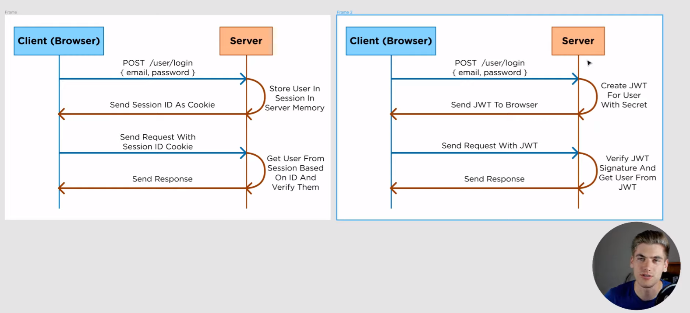
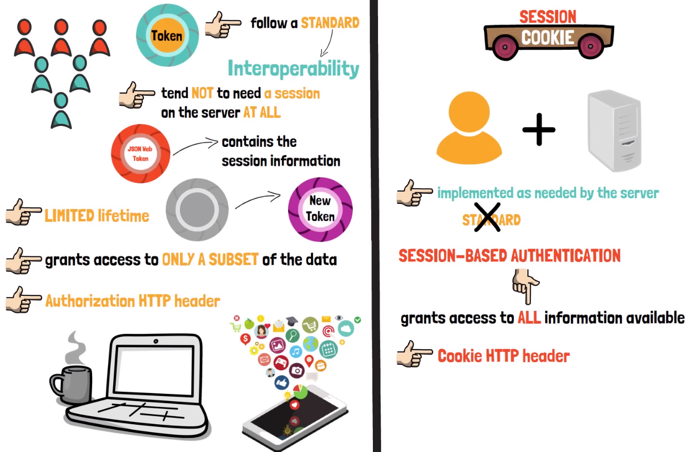
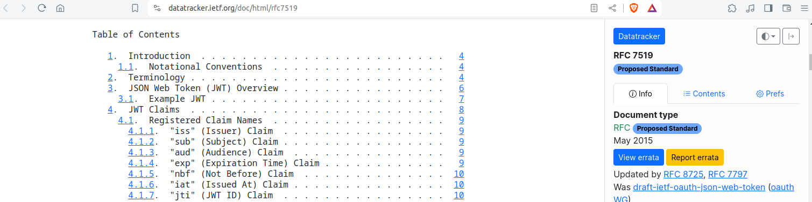

# Dive into REST API with NestJS

```js
npm install -g @nestjs/cli
nest --help
```

```js
nest g module users
nest g service users
nest g controller users
# or
nest g resource users
# Rest Api, yes, ...
```

## To remove unauthorized field from the incoming data

```js
app.useGlobalPipes(
    new ValidationPipe({
        whitelist: true,
        // forbidNonWhitelisted: true // to stop the request from processing in such case
    }),
    );
```

```js
POST
{
  "name": "Pierre Dupont",
  "stageName": "Pierro",
  "email": "pierro@gmail.com",
  "profile": "PARTNER",
  "city": "Lens"
}
WILL RETURN (no expected field 'city')
{
  "name": "Pierre Dupont",
  "stageName": "Pierro",
  "email": "pierro@gmail.com",
  "profile": "PARTNER"
}
```

## [Guards](https://docs.nestjs.com/guards)

Guards have a single responsibility. They determine whether a given request will be handled by the route handler or not, depending on certain conditions (like permissions, roles, ACLs, etc.) present at run-time.

**Use cases**: authorization, authentification

***They***

- could be
  - controller-scoped, method-scoped (`@UseGuards()`)
  - or global-scoped (`useGlobalGuards()`, `useClass`)
- are executed after all middleware, but before any interceptor or pipe.

**Why not middlewares instead**: For authentification, they are fine choice, since things like token validation and attaching properties to the request object are not strongly connected with a particular route context (and its metadata). But middlewares doesn't know which handler will be executed after calling the `next()` function. On the other hand, Guards have access to the `ExecutionContext` instance, and thus know exactly what's going to be executed next.

**To take advantage of the most important guard feature, the execution context (in order to determine what is allowed or not)**, we'll attach custom metadata to route handlers through either decorators created via Reflector#createDecorator static method, or the built-in @SetMetadata() decorator.

  ```ts
  import { Reflector } from '@nestjs/core';
  export const Roles = Reflector.createDecorator<string[]>();
  ```

  ```ts
  @Post()
  @Roles(['admin'])
  async create(@Body() createCatDto: CreateCatDto) {
    this.catsService.create(createCatDto);
  }
  ```

quickstart: `nest g guard guard_name`

## Exceptions filters

***To process all unhandled exceptions accross the app.***

- The built-in global exception filter handles exceptions of type **HttpException** (and subclasses of it, and partially supports the http-errors). So when an exception is caught (not of that last one type), we'll get a default JSON response:

  ```json
  {
    "statusCode": 500,
    "message": "Internal server error"
  }
  ```

- Any thrown exception containing the statusCode and message properties will be properly populated and sent back as a response (instead of the default InternalServerErrorException for unrecognized exceptions):

  ```js
  @Get()
  async findAll() {
    throw new HttpException('Forbidden', HttpStatus.FORBIDDEN);
  }
  ```

  Apart these two arguments (response message, response status code), there is a third constructor argument (optional and not serialized in the response but could be useful, for logging purposes, to provide valuable information about the inner error that caused the HttpException to be thrown):

  ```js
  @Get()
  async findAll() {
    try {
      await this.service.findAll()
    } catch (error) {
      throw new HttpException({
        status: HttpStatus.FORBIDDEN,
        error: 'This is a custom message',
      }, HttpStatus.FORBIDDEN, {
        cause: error
      });
    }
  }
  ```

- [Built in Exception](https://docs.nestjs.com/exception-filters#built-in-http-exceptions)

  ```js
  throw new BadRequestException('Something bad happened', { cause: new Error(), description: 'Some error description' })
  // -->
  {
    "message": "Something bad happened",
    "error": "Some error description",
    "statusCode": 400,
  }
  ```

- Custom exceptions
  When we have to create custom exceptions (not frequent), we could make them inherit from the base ***HttpException*** class. With this approach, Nest will recognize your exceptions, and automatically take care of the error responses:

  ```js
  export class ForbiddenException extends HttpException {
    constructor() {
      super('Forbidden', HttpStatus.FORBIDDEN);
    }
  }
  ```
  
  and, when needed, ex.:

  ```js
  @Get()
  async findAll() {
    throw new ForbiddenException();
  }
  ```

- [A proper way to achieve things](../src/http-exception.filter.ts)
  - Test by yourself: GET localhost:3000/wzt/artists/bad
  - That way, expect that, recognized exceptions will be thrown ([built-in exceptions](https://docs.nestjs.com/exception-filters#exception-filters-1) or customs exceptions which inherit from ***HttpException*** class)
  - Prefer applying filters by using classes (`@UseFilters(HttpExceptionFilter)`) instead of instances ( `@UseFilters(new HttpExceptionFilter()`) when possible. It reduces memory usage since Nest can easily reuse instances of the same class across your entire module.
  - The **useGlobalFilters() method** could be used to set up global-scoped filter (which not work for gateways or hybrid applications)
  - An alternative to that ***custom provider registration*** issue is **useClass method**

    ```js
    // app.module.ts
    import { Module } from '@nestjs/common';
    import { APP_FILTER } from '@nestjs/core';

    @Module({
      providers: [
        {
          provide: APP_FILTER,
          useClass: HttpExceptionFilter,
        },
      ],
    })
    export class AppModule {}
    ```

    The module to choose (here app one), should be the one in which the filter (HttpExceptionFilter in the example above) is defined.
  
  - We could also use [**dependency injection**](https://docs.nestjs.com/fundamentals/custom-providers) (Have to test!).

- [Catch everything](https://docs.nestjs.com/exception-filters#catch-everything)

  ***Use Cases***: full control over the exceptions layer, add logging or use a different JSON schema based on some dynamic factors, control the exact flow of control and the content of the response sent back to the client.

  To catch everything, we omit the target exception in `@Catch() decorator`.

  - While catching everything, **useClass method** is the one to preconize ([Learn More About it](https://docs.nestjs.com/exception-filters#binding-filters)).

- Nest Request / Response Pipeline
  - <https://github.com/mguay22/nestjs-request-response-pipeline>
  - <https://stackoverflow.com/questions/54863655/whats-the-difference-between-interceptor-vs-middleware-vs-filter-in-nest-js>
  

- [Logger](https://docs.nestjs.com/techniques/logger)
  A filter exception could be use to add custom logger (which can be use in security, performance or debugging purposes...).

  When it's the case, we'll have to configure Nest as follow:

  ```ts
  const app = await NestFactory.create(AppModule, {
  bufferLogs: true,
  });
  app.useLogger(app.get(MyLogger));
  await app.listen(3000);
  ```

  ex.: We want to track all incoming requests of GET type

  ```ts
  // ...
  private readonly logger = new MyLoggerService(EmployeesController.name);
  @Get()
  findAll(@Ip() ip:string, @Query('role') role?: 'INTERN' | 'ENGINEER' | 'ADMIN') {
    this.logger.log(`Request for ALL Employees\t${ip}`, EmployeesController.name);
    return this.employeesService.findAll(role);
  }
  ```

- JWT (Json Web Token)
  - Intro
    - JWT is used for authorization (to check that the user who sends requests against your app is the same who logged in (authenticated)).
    - **authentication** relates to "Are you who you claim to be?"
    - **authorization** relates to "What are you allowed to do?"
    - Its an alternative to cookies + sessions (instead of create a session id which will be saved in cookies we could use jwt which will use Json Web Token to check authorization)
    
    
    By using JWT:
      - the server doesn't store nothing (it have to remember anything)
      - in the jwt, we have all the informations about the users
      - the browser could store that info in cookie storage
      - for each request from the client, the server will verify the validity (the signature of the jwt)
    - <https://www.youtube.com/watch?v=GhrvZ5nUWNg>
    - <https://www.youtube.com/watch?v=7Q17ubqLfaM>
    - <https://www.youtube.com/watch?v=UBUNrFtufWo&list=TLPQMDcwNTIwMjSAt0qkC_9vdg&index=2>
  
  - More about JWT
    
    - <https://www.youtube.com/watch?v=S-xBAo47W58>
    - <https://datatracker.ietf.org/doc/html/rfc7519>
    - <https://www.youtube.com/watch?v=uAKzFhE3rxU>

- Auth using JWT

  ```bash
  nest g module auth
  nest g controller auth
  nest g service auth

  nest g module users
  nest g service users

  npm install --save @nestjs/jwt
  ```

  ```http
  POST localhost:3000/wzt/auth/login
  BODY 
  {
    "username": "maria",
    "password": "guess"
  }
  -->
  {
  "access_token": "..."
  }
  ```

  ```http
  GET localhost:3000/wzt/auth/profile
  Auth Bearer access_token_value
  -->
  {
    "sub": 2,
    "username": "maria",
    "iat": 1715079651,
    "exp": 1715079711
  }
  ```

  - use auth as global-scoped

    ```ts
    providers: [
      {
        provide: APP_GUARD,
        useClass: AuthGuard,
      },
    ],
    ```

    - When that's the case, we may define a mechanisme to define some routes public

      ```ts
      // in auth/decorators/public.decorator.ts
      import { SetMetadata } from '@nestjs/common';
      export const IS_PUBLIC_KEY = 'isPublic';
      export const Public = () => SetMetadata(IS_PUBLIC_KEY, true);
      ```

      ```ts
      // in auth/target.file.ts
      @Public()
      @Get()
      findAll() {
        return [];
      }
      ```

    - <https://docs.nestjs.com/security/authentication>
    - <https://github.com/nestjs/nest/tree/master/sample/19-auth-jwt/src>
    - <https://jwt.io/>
    - <https://docs.nestjs.com/recipes/passport>
  
  - Prisma
    - Prisma is an open-source ORM for Node.js and TypeScript. It is used as an alternative to writing plain SQL, or using another database access tool such as SQL query builders (like knex.js) or ORMs (like TypeORM and Sequelize). Prisma currently supports PostgreSQL, MySQL, SQL Server, SQLite, MongoDB and CockroachDB (Preview).
    - Prisma client allow you to perform CRUD operations against your database
    - Init

      ```bash
      npm install -g @nestjs/cli
      npm install prisma --save-dev # install prisma as dependency of your project
      npx prisma # a best practice consists to prefix prisma commands with npx
      npx prisma init # to create initial prisma setup, it also create a directory which contain schema.prisma file; a dotenv file (.env) will be use to store the db credentials
      npx prisma migrate dev --name init # It creates a new SQL migration file for this migration and run that SQL migration file against the database.
      npm install @prisma/client # Prisma Client is a type-safe database client, generated from your Prisma model definition. It allow you to perform CRUD operations against your database.

      npx prisma generate # During installation, Prisma automatically invokes the prisma generate; This command should be run after every change

      prisma migrate dev --name <migration-name> # A dev env shortcut, an alternative to prisma migrate save + prisma migrate up + prisma generate
      ```

      The prisma generate command reads your Prisma schema and updates the generated Prisma Client library inside node_modules/@prisma/client.

      As did in 'src/users/users.service.ts' and 'src/posts/posts.service.ts', that way of use Prisma Client's generated types ensure that the methods which are exposed by your service are properly typed, avoid you typing your models and creating additional interface or DTO files.

      - Summary
        - `npx prisma migrate dev --name migration_name` To map your data model to the database schema
        - **Whenever you update your Prisma schema, you will have to update your database schema using either `prisma migrate dev` or `prisma db push`. This will keep your database schema in sync with your Prisma schema and regenerate Prisma Client.**

      [About app endpoints](./doc/about_app_endpoints.md)

    - [Prisma models](https://www.prisma.io/docs/orm/prisma-schema/data-model/models)
      - The data model definition part of the Prisma schema defines your application models (also called Prisma models)
        - In relational databases like PostgreSQL and MySQL, a model maps to a table
        - In MongoDB, a model maps to a collection
        - Prisma model naming conventions (singular form, PascalCase) do not always match table names in the database. A common approach for naming tables/collections in databases is to use plural form and snake_case notation
          - By using `@@map` attribute Prisma ORM automatically maps the `Comment` model to the `comments` table in the underlying database (@map for a column name or enum value)

          ```js
          model Comment {
            // Fiels

            @@map("comments")
          }
          ```

          - [Defining fields](https://www.prisma.io/docs/orm/prisma-schema/data-model/models#defining-fields)
            - model properties (field name, field type, optionals type modifiers, optional attributes...)
            - A field's type determines its structure, and fits into one of two categories:
              - Scalar types (include enum) that map to **columns in relational database**
              - Model types which are **relation fields**
          - [Defining attributes](https://www.prisma.io/docs/orm/prisma-schema/data-model/models#defining-attributes)
            - Attributes modify the behavior of fields or model blocks.
          - [Queries (CRUD)](https://www.prisma.io/docs/orm/prisma-schema/data-model/models#queries-crud)
        - [Relations (one-to-one, one-to-many, many-to-many, self-relations)](https://www.prisma.io/docs/orm/prisma-schema/data-model/relations)

    - [Prisma by Nest](https://docs.nestjs.com/recipes/prisma)
    - [Getting started with prisma](https://www.prisma.io/docs/getting-started)
    - [Start from scratch](https://www.prisma.io/docs/getting-started/setup-prisma/start-from-scratch)
    - [REST API with NestJS, PostgreSQL, Swagger and Prisma](https://www.prisma.io/blog/series/nestjs-prisma-kges29apbbik)
    - [By Web Dev Simplified](https://www.youtube.com/watch?v=RebA5J-rlwg)

    - Ready to run
      - [rest nest prisma ex](https://github.com/prisma/prisma-examples/tree/latest/typescript/rest-nestjs)
      - [nestjs prisma starter](https://github.com/notiz-dev/nestjs-prisma-starter/tree/main/src)
      - [prod ready starter kit](https://github.com/notiz-dev/nestjs-prisma-starter#instructions)

### TODO

-m "Update auth system (bcrypt to hash pwd...)"

- Improve README.md
- [Use bcrypt to hash db pwd](https://github.com/kelektiv/node.bcrypt.js#readme)
- Use hash IDs for db tables
- [Abt modules](https://docs.nestjs.com/modules)

- Improve Logger (to make it work properly!)
- [Testing](https://docs.nestjs.com/fundamentals/testing)

- Middleware
- Interceptors
- <https://docs.nestjs.com/recipes/swc>
- <https://github.com/trab-ml/nestjs>
- <https://docs.nestjs.com/>
